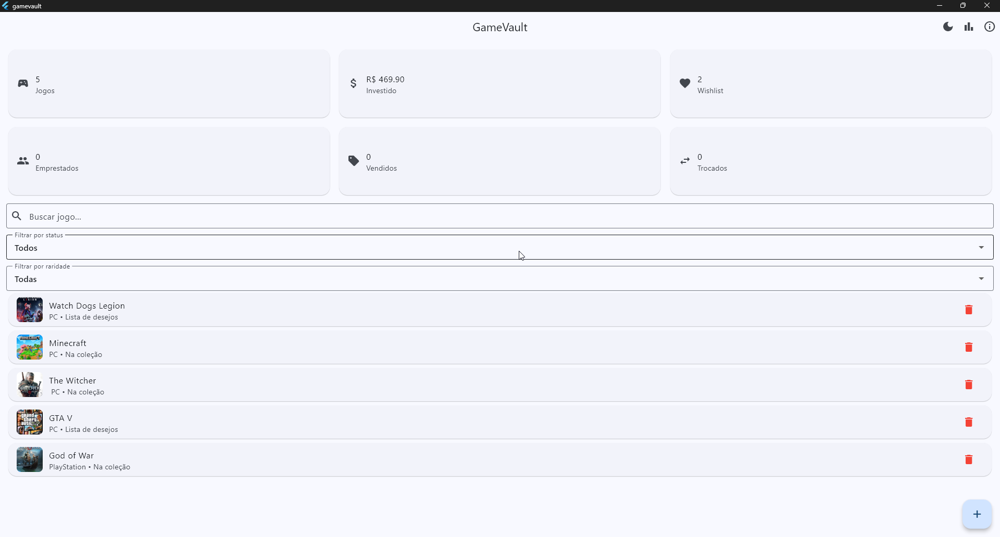
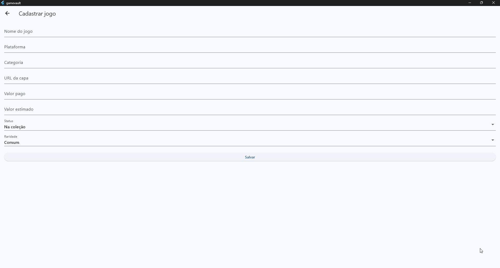
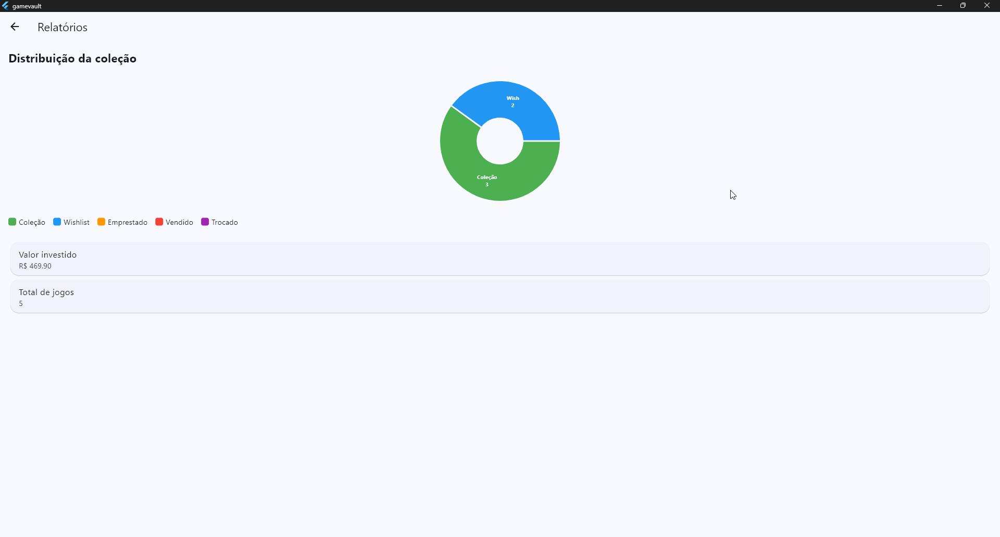
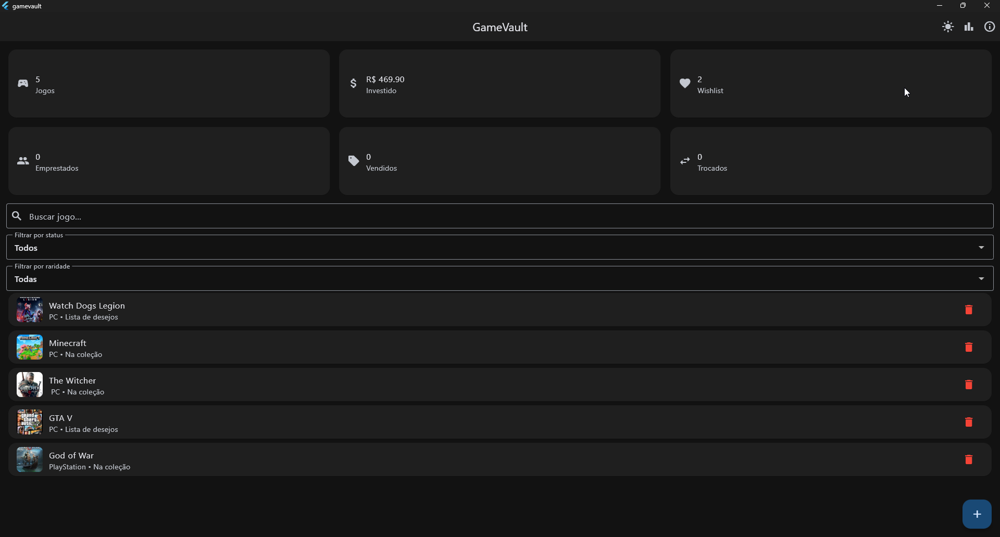

# 🎮 GameVault

Sistema de gerenciamento de coleção de jogos desenvolvido em Flutter como projeto acadêmico do curso de Análise e Desenvolvimento de Sistemas.

## 📌 Informações do Projeto

**Aluno:** Weden Gabriel da Silva Gomes  
**RU:** 4170826  
**Curso:** Análise e Desenvolvimento de Sistemas  
**Instituição:** UNINTER  
**Disciplina:** Desenvolvimento Multiplataforma Desktop  
**Projeto:** GameVault – Sistema de gerenciamento de coleção de jogos

## 📖 Sobre o projeto

O GameVault é um aplicativo desenvolvido para auxiliar usuários no gerenciamento de sua coleção de jogos digitais e físicos.

O sistema permite cadastrar, visualizar, editar, excluir e organizar jogos por diferentes critérios, além de gerar relatórios e indicadores da coleção.

O projeto foi desenvolvido utilizando Flutter e SQLite, aplicando conceitos de:

- CRUD
- Persistência de dados
- Navegação entre telas
- Filtros
- Relatórios
- Interface adaptável
- Tema claro e escuro
- Armazenamento local

## ✨ Funcionalidades

- Cadastro de jogos
- Edição de jogos
- Exclusão com confirmação
- Pesquisa por nome
- Filtro por status
- Filtro por raridade
- Dashboard com indicadores
- Relatórios gráficos
- Tela de detalhes
- Tema claro/escuro
- Persistência com SQLite
- Salvamento de preferências

## 🛠 Tecnologias utilizadas

O projeto foi desenvolvido utilizando as seguintes tecnologias:

- Flutter
- Dart
- SQLite
- sqflite
- sqflite_common_ffi
- SharedPreferences
- fl_chart
- Material Design 3

---

## 📂 Estrutura do projeto

```text
lib/
├── database/
│   └── database_helper.dart
│
├── models/
│   └── game_model.dart
│
├── services/
│   └── game_service.dart
│
├── screens/
│   ├── about_screen.dart
│   ├── game_detail_screen.dart
│   ├── game_form_screen.dart
│   └── report_screen.dart
│
└── main.dart
```

---

## 🧠 Funcionalidades implementadas

### Dashboard
Exibe indicadores rápidos:

- Quantidade de jogos
- Valor investido
- Wishlist
- Jogos emprestados
- Jogos vendidos
- Jogos trocados

### Sistema de filtros

Permite:

- buscar jogos por nome
- filtrar por status
- filtrar por raridade

### Relatórios

O sistema gera gráficos para visualização dos dados cadastrados.

### Persistência

Os dados são armazenados localmente utilizando SQLite.

Além disso, preferências do aplicativo, como tema escuro/claro, são salvas utilizando SharedPreferences.

---

## ▶ Como executar o projeto

Clone o repositório:

```bash
git clone https://github.com/wedengabriel/gamevault.git
```

Entre na pasta do projeto:

```bash
cd gamevault
```

Instale as dependências:

```bash
flutter pub get
```

Execute:

```bash
flutter run
```

Ou escolha uma plataforma específica:

Windows:

```bash
flutter run -d windows
```

Android:

```bash
flutter run
```

Web:

```bash
flutter run -d chrome
```

---

## 📦 Versões compiladas

O projeto possui versões compiladas para diferentes plataformas:

### Windows
Arquivo executável:

```text
gamevault.exe
```

### Android
Arquivo instalável:

```text
app-release.apk
```

Não é necessário instalar dependências para executar as versões compiladas.

---

## 📸 Imagens do sistema

### Tela inicial



### Cadastro de jogos



### Relatórios



### Tema escuro



### Tema claro


---

## 🚀 Status do projeto

Projeto finalizado e funcional.

Recursos implementados:

✅ CRUD completo  
✅ SQLite  
✅ Persistência de dados  
✅ Dashboard  
✅ Relatórios gráficos  
✅ Tema claro/escuro  
✅ Preferências salvas  
✅ Versão Windows (.exe)  
✅ APK Android

---
## 👨‍💻 Autor

Weden Gabriel da Silva Gomes

RU: 4170826

Curso: Análise e Desenvolvimento de Sistemas — UNINTER

GitHub:

https://github.com/wedengabriel/gamevault